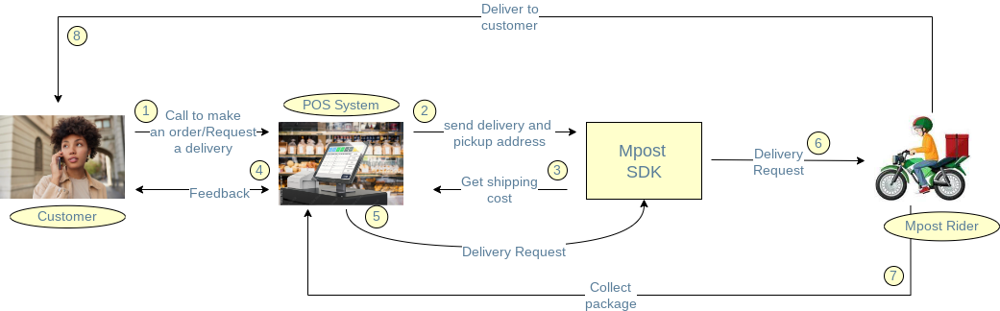

# Mpost JavaScript SDK

This SDK aims to help the development of integrations with
[Mpost](https://mpost.co.ke/) that use JavaScript, providing an easy
interface to communicate with
[Mpost's REST API](https://mpost.co.ke/).


## Requirements

To use this SDK, you will need:

- [Node.js **v6.3.0 or above**](https://nodejs.org/)

Node installation will include [NPM](https://www.npmjs.com/), which is
responsible for dependency management.

## Installation

### Node.js

`npm install @ekbaya/mpost-js-sdk`

`import Mpost from '@ekbaya/mpost-js-sdk';`


## Usage

This SDK relies heavily on [Promises](https://developers.google.com/web/fundamentals/getting-started/primers/promises),
making it easier to handle the asynchronous requests made to the API. The SDK
provides a `Mpost` object containing several methods which map to the
calls and parameters described in
[Mpost's API documentation](https://mpost.co.ke/).

The following snippet is a generic example of how to use the SDK. If you need
details for a specific module, refer to the
[example](https://github.com/MSureKE/mpost-js-sdk/blob/master/mpost-js-sdk-example/src/app.ts).

Before executing any request, you need to authorize the calls to the API:


#### Using a API KEY
```js
const mpost = new Mpost({
  apiKey: "<Your-API-KEY>",
});
```

#### Making requests

You can now use the various methods from the SDK to create delivery requests, fetch delivery requests
and other data. Following the Promises notation, you should use
`.then()`/`.catch()` to handle the successful and failed requests,
respectively.

Most of the calls take an object as the only parameter but please refer to the
API documentation to tune the query as intended.


Get Delivery Requests

```js
mpost.getDeliveryRequests().then((p) => {
  console.log(p);
});
```

Get A Single Delivery Request
```js
mpost.getDeliveryRequestById(123).then((p) => {
  console.log(`DATA: ${p}`);
})
  .catch(error => {
    console.log(`You request could not be processed`);
  });
```

Create  Delivery Request

```js
mpost
  .createDeliveryRequest({
    pickup_address: {
        latitude: 37.785834,
        longitude: -122.406417,
        address: "Globe Round About",
        detailed_address: "Sunrays House, Near Globe Cinema Roundabout, Nairobi City"
    },
    delivery_address: {
        latitude: 40.659569,
        longitude: -73.933783,
        address: "Globe Round About",
        detailed_address: "Sunrays House, Near Globe Cinema Roundabout, Nairobi City"
    },
    recipient_name: "Elias Baya",
    recipient_mobile: "0712345678",
    item_type: "Test",
    pickup_time: "2022-02-02 11:11:00"
  })
  .then(data => {
    // TODO Handle data
  })
  .catch(error => {
    // TODO Handle the error
  });
```
Calculate Distance and Delivery Cost
```js
mpost
  .calculateDistance({
    pickup_address: {
        latitude: -0.9534506,
        longitude: 37.0820681
    },
    delivery_address: {
        latitude: -1.046594,
        longitude: 37.060197
    }
  })
  .then(data => {
    // TODO Handle data
  })
  .catch(error => {
    // TODO Handle the error
  });
```

## Available methods

### Delivery

- `getDeliveryRequests(queryObject)`
- `getDeliveryRequestById(queryObject)`
- `createDeliveryRequest(queryObject)`
- `calculateDistance(queryObject)`

## Creating Delivery Request Case Study
